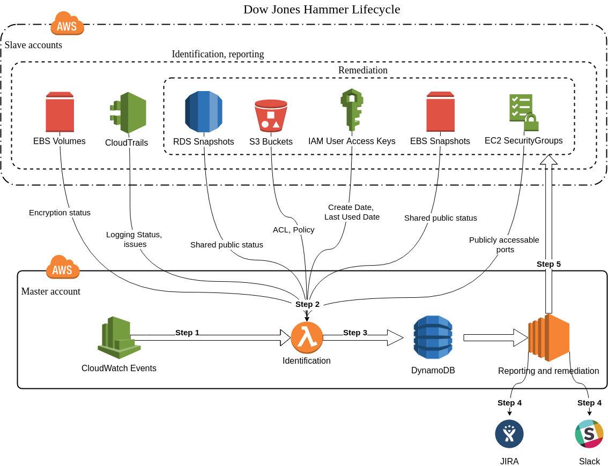

## Introduction

Dow Jones Hammer is a cloud security tool designed to keep your Amazon Web Services landscape safe.
As soon as you have deployed Dow Jones Hammer, it detects [typical AWS services vulnerabilities](features.html) on a regular basis and writes information about discovered vulnerabilities to DynamoDB tables.

Optionally, you can:
* enable CSV reporting with detected vulnerabilities to designated S3 bucket;
* use Dow Jones Hammer API to perform ad-hoc scans of controlled environments;
* integrate Dow Jones Hammer with JIRA and/or Slack. After detecting an issue, Dow Jones Hammer can raise a JIRA ticket for a specific person and/or send a Slack message to a specific Slack channel or directly to a Slack user;
* configure Dow Jones Hammer so that it can automatically remediate certain issues it had detected, if these issues have persisted for a given timeframe.

## Architecture Diagram

Below you can find the architecture diagram of full Dow Jones Hammer lifecycle.

{:refdef: style="text-align: center;"}

{: refdef}

**Note**:
* **Master** account - the AWS account where you deploy and run Dow Jones Hammer;
* **Slave** accounts - all other AWS accounts that Dow Jones Hammer inspects; you can set up one or more slave AWS accounts for Dow Jones Hammer to take care of.

Reporting and remediation functionality (steps 4 and 5) are optional and implemented as separate CloudFormation stacks for [master](deployment_cloudformation.html#3-deploy-cloudformation-stacks-to-the-master-aws-account) and [slave](deployment_cloudformation.html#4-deploy-cloudformation-stacks-to-the-slave-aws-accounts) accounts.
In case you do not need this functionality you can skip its deployment and write your own code based on the information from DynamoDB tables to implement custom functionality.

## Lifecycle Description

**Step 1**: CloudWatch Events launches an instance of the **initialization** Lambda function which after that launches multiple instances of the **identification** Lambda function.

* The **initialization** Lambda function selects slave accounts to check for this issue as designated in the Dow Jones Hammer configuration files and triggers the check.
* The **identification** Lambda function identifies the issue for each account/region selected by the initialization Lambda function.

By default CloudWatch Events launches **initialization** Lambdas once an hour (maximum possible identification frequency). You can decrease it while deploying the identification CloudFormation stack by changing any part of [IdentificationCheckRateExpression](deployment_cloudformation.html#313-identification-functionality) parameter with [CloudWatch Schedule Cron Expression](https://docs.aws.amazon.com/AmazonCloudWatch/latest/events/ScheduledEvents.html#CronExpressions).
Minutes part are hardcoded to spread Lambda execution because of AWS Lambda [concurrent execution limit](https://docs.aws.amazon.com/lambda/latest/dg/limits.html#limits-list).

**Step 2**:
Identification lambdas identify all enabled issues.
You can configure for each issue type independently whether identification is enabled or not.

**Step 3**:
Identification lambdas create records in DynamoDB table defined in the configuration file for all identified issues.

**Step 4**:
Reporting engine according to discovered issues in DynamoDB creates tickets in JIRA or sends notification to Slack.
You can configure for each issue type independently whether reporting is enabled or not.

**Step 5**:
Dow Jones Hammer provides automatic remediation for some issue types within defined timeframe after reporting.
You can configure for each issue type independently whether automatic remediation is enabled or not.
Additionally you can run remediation scripts manually from reporting and remediation EC2 instance.
See the list of the issues for which Dow Jones Hammer supports remediation in the corresponding area at the diagram.

You can find detailed descriptions of described steps further in the User Guide.

## Implementation Details

* Dow Jones Hammer is written in [Python](https://www.python.org/), versions starting from 3.6 are supported;
* Identification lambdas are configured to use `python3.6` runtime;
* Reporting and remediation engine runs on EC2 with the latest version of `CentOS 7`, using Python 3.6 installed from [IUS Community Project](https://ius.io/).